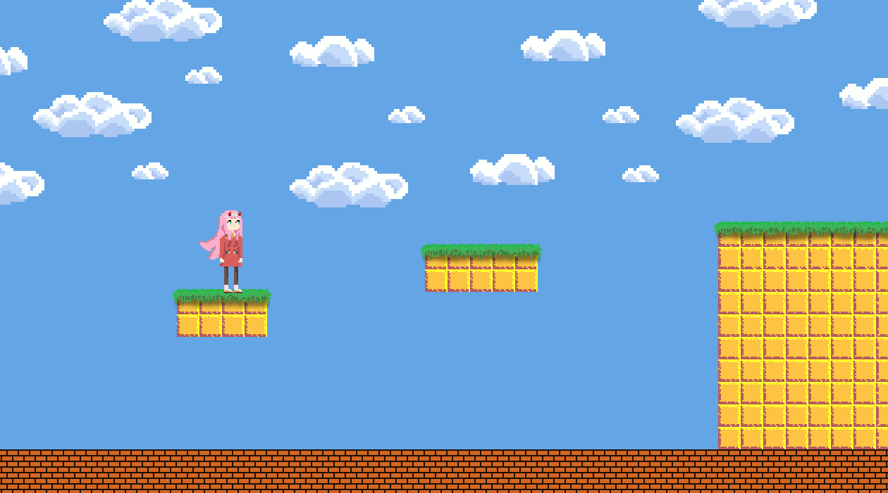

# Platformer

A generic platformer

## 🛠️ Language and Framework
<div>
    &nbsp;
    &nbsp;
<div>

## ✅ Requirements

1. Download the [LÖVE 2D](https://love2d.org/) framework and create a shortcut
2. Clone the repository

```shell
git clone https://github.com/leo9iota/platformer.git
```

3. Drag the folder onto the LÖVE 2D shortcut

## 📈 Progression

<div>
    
<div>