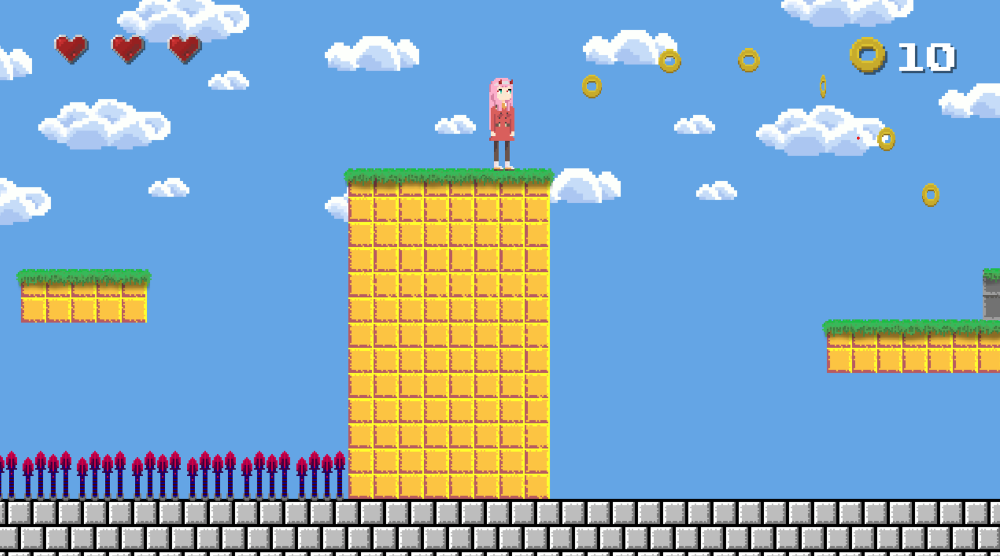

# 🏃‍♂️‍➡️ Platformer

A classic platformer game inspired by the [Super Mario](https://supermario-game.com/) game series.

## 🛠️ Tech Stack
<div>
    &nbsp;
    &nbsp;
    &nbsp;
    &nbsp;
    &nbsp;
<div>

## ▶️ How To Play

1. Download the [Love2D framework](https://love2d.org/) and set the environment variable.
2. Clone the repository and go to the root directory.

```sh
git clone https://github.com/leo9iota/darling-in-the-goland.git && cd darling-in-the-goland
```

3. Run the following command and have fun!

```sh
love .
```

## 📈 Progression

<div>
    
<div>
