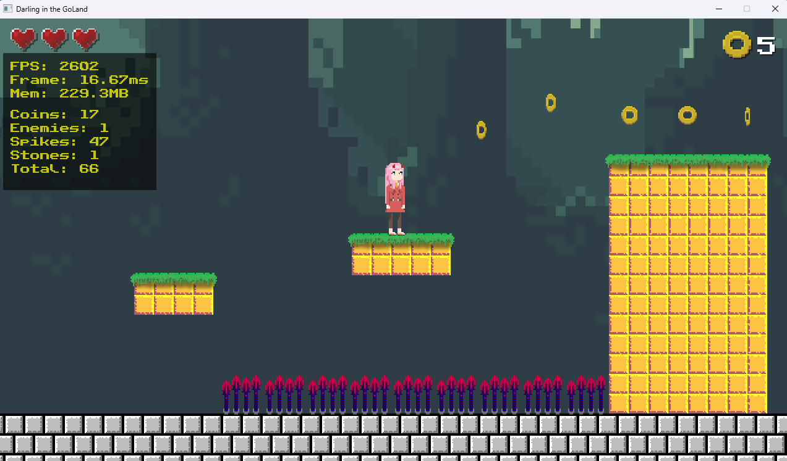

# Darling in the GoLand

Classic platformer game inspired by [Super Mario](https://supermario-game.com/) in a retro pixel art style, rewritten in [Go](https://go.dev/) with [Ebitengine](https://ebitengine.org/).

> The project name is a pun on the anime Darling in the FranXX, the Go programming language, and the JetBrains GoLand IDE.



## Prerequisites

- [Go](https://go.dev/) 1.26+
- [Just](https://just.systems/) (optional, for build commands)

## Quick Start

```bash
# Run directly
go run ./cmd/game

# Or via Just
just run

# Build executable
just build-windows
```

## Controls

| Key            | Action                                     |
| -------------- | ------------------------------------------ |
| A / D or ← / → | Move left / right                          |
| W or ↑         | Jump (press again mid-air for double jump) |
| Escape         | Toggle pause menu                          |
| F3             | Toggle debug overlay                       |

## Build Targets

```bash
just build-windows     # Windows (amd64)
just build-linux       # Linux (amd64)
just build-macos       # macOS (amd64)
just build-macos-arm   # macOS (arm64)
just build-all         # All platforms
```

## License

[MIT](./LICENSE)
